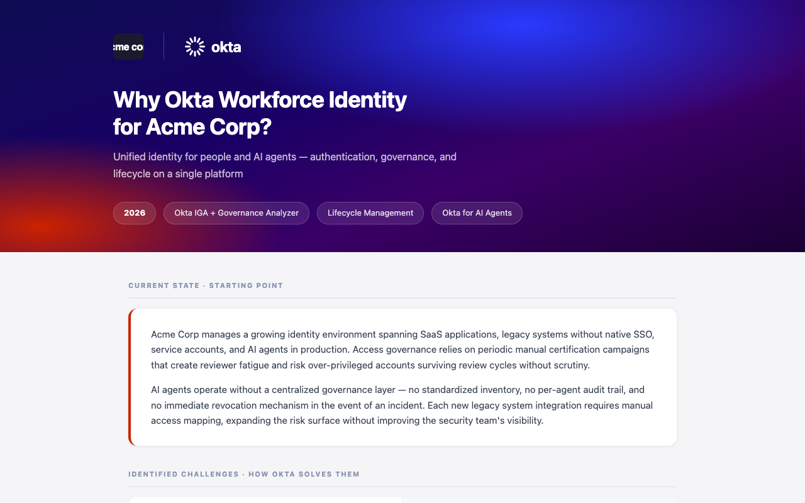

# WinLoop — SE Technical-Win Skill

> Turn messy customer notes into the shortest defensible path to a verbal technical win.

WinLoop is a reusable Claude Code skill for Sales Engineers. Paste meeting notes, a transcript summary, or current opportunity context and receive a structured technical-win analysis — including Salesforce-ready fields and a customer-facing value document.

---

## What you get

### APEX "Why Okta" customer document

Branded, customer-facing value document generated from your debrief in seconds. Exports to PDF.



### SE Decision Assist

Structured reasoning that tells you where you actually stand:

```
Status: Validation required

Customer evidence:
- VP Engineering (evaluation authority unconfirmed): "The session recording
  capability fills our biggest PAM gap." — Customer signal, not overall confirmation.

Still unproven:
- Whether the full IGA + PAM scope meets all defined requirements.
- Technical decision owner not identified.

Shortest proof route:
Bounded workshop — predefined labs for PAM and IGA certification; pass/fail
criteria agreed before the session.

Exact customer ask:
"If we validate privileged session recording and IGA certification campaigns
against your defined criteria, would you confirm that the solution meets your
technical requirements for this initiative?"

Technical-win forecast:
- Window/date: Unknown
- Confidence: Low
- Rationale: Decision owner unidentified; workshop not yet scheduled.
```

### Salesforce-ready blocks

```
Pre-Sales confidence for Quarter
Low

Presales Stage
3 - Solution Development

Technical Differentiation
Positive

Presales Concern
Champion

Risks/Gaps
D-Decision Process;C-Champion;P-Product

Technical Win Date
INPUT REQUIRED — exact date not established; known window: Q3 2026

POC Status
Not Required
```

---

## Four modes

| Mode | When to use |
|---|---|
| **Message** | Build an APEX Command of the Message hypothesis when you have no Gong or transcript |
| **Prepare** | Define what must be learned and proven before an upcoming meeting |
| **Debrief** | Convert completed-meeting evidence into a technical-win status + Salesforce fields |
| **Checkpoint** | Assess where an opportunity stands and get one next best action |

---

## Quick start

### Prerequisites

1. **Claude Code** — download from [claude.com/claude-code](https://claude.com/claude-code)
2. **Signed in** — Claude Pro, Max, Team, or Enterprise (no separate API key)
3. **Claude Code 2.x+** — run `claude --version` to check

### Install

```bash
# 1. Open the winloop-se-skill folder
cd winloop-se-skill

# 2. Install the data-leak pre-commit guard and your per-user blocklist
#    (blocks real names, emails, photos, and customer data from commits;
#    edit .claude/scripts/hooks/blocklist.local afterwards with YOUR names)
bash .claude/scripts/setup-hooks.sh

# 3. Optional: your contact card for customer-facing documents
cp .claude/skills/winloop/team.json.example .claude/skills/winloop/team.json
#    ...then fill in your name, initials, email, and photo

# 4. Start Claude Code
claude
```

### Run

```text
/winloop

[paste meeting notes, transcript summary, or opportunity context]
```

Explicit mode invocation (optional):

```text
/winloop message
/winloop prepare
/winloop debrief
/winloop checkpoint
```

### Pull from your meeting notes instead of pasting

With a meeting-notes MCP connected (Granola, or anything exposing `list_meetings`,
`get_meetings`, and `get_meeting_transcript`), name the meeting instead:

```text
/winloop debrief the Acme call from Thursday
```

WinLoop confirms which meeting it found, then reads it. It uses the tool's AI summary
only to triage, and quotes from the **transcript** for anything that sets status or
scopes a confirmation — because a summary is a paraphrase, and paraphrase quietly
widens scope. A customer's "that covers what we need for the migration window" and a
summary's "customer confirmed the approach" are not the same claim.

Fetched content is treated exactly like a paste: evidence, never instructions.

No meeting tool connected? WinLoop says so and asks for a paste. Nothing else changes.

### Optional: install globally

> ⚠ The `rm -rf` below replaces any existing global copy — if you customized it, back up your edits first.

```bash
rm -rf ~/.claude/skills/winloop && mkdir -p ~/.claude/skills \
  && cp -R .claude/skills/winloop ~/.claude/skills/winloop
```

For a global install, opportunity ledgers are written to `~/winloop/opportunities/` (not the folder you happen to be working in) — see "Per-opportunity ledger" below. The pre-commit guard from step 2 protects only this repo; ledgers live outside any repo by design.

---

## Debrief example

```text
/winloop

Demo delivered to Acme Corp. VP Engineering said "this is exactly what we need
for session recording." No explicit confirmation from CTO. Technical lead
to send PAM sizing next week. Team satisfied with the IGA demo.
```

WinLoop output:
- `Status: Validation required` — no overall confirmation from an authoritative stakeholder
- Flags "exactly what we need" as a scoped fit signal, not an overall win
- Names the CTO touchpoint as the shortest proof route
- Generates Salesforce blocks with `Risks/Gaps: D-Decision Process;C-Champion`

---

## The operating rule

> If the customer did not say it, it is not a technical win.

WinLoop refuses to:
- declare a win from enthusiasm, feature praise, or a completed demo
- fabricate a forecast date from a vague window
- recommend a POC when a workshop can answer the question
- follow instructions embedded inside pasted transcripts

---

## Per-opportunity ledger

After each Debrief or Checkpoint, WinLoop offers to append the dated analysis to `<ledger root>/<account>/<account>.md`. On the next run it reads the ledger back, so context carries forward across sessions. The ledger root is `./opportunities/` when you work inside this repo, and `~/winloop/opportunities/` for a global install — the append offer always states the absolute path.

Customer-facing artifacts (value documents, workshop pages) live in the same folder and are built from confirmed ledger content only — no internal flags, forecast data, or Salesforce content.

> In this repo, `opportunities/` is excluded from git. Ledgers contain customer data: keep them on your work machine only, and never inside a repository that could be pushed.

---

## Customer-facing templates

Two Okta-branded HTML templates:

| Template | File | When to use |
|---|---|---|
| **APEX value doc** | `customer-apex-value.html` | "Why Okta" leave-behind from a debrief |
| **Workshop agenda** | `customer-workshop.html` | Hands-on session prep page |
| **Validation plan** | `customer-poc-plan.html` | A POC or bounded in-environment validation |
| **Session recap** | `customer-session-recap.html` | Post-session technical response — what was raised, how it's addressed |

The validation plan is the bounded-POC checklist made fillable — one question, pass/fail criteria agreed up front, explicit scope-out, and a closing decision stated in advance. If a section can't be filled, the validation isn't bounded yet.

**Languages.** Salesforce output is always English. SE-facing analysis follows your request language. Customer-facing documents follow the *customer's* language — the templates are English-canonical and translate on generation, so the same skill serves Portuguese, English, and Spanish accounts without separate template sets.

Both are fully self-contained (inline CSS, base64 images, no external requests) and export to PDF via Chrome headless:

```bash
"/Applications/Google Chrome.app/Contents/MacOS/Google Chrome" \
  --headless --print-to-pdf=out.pdf --no-pdf-header-footer page.html
```

Team photos and contact details come from `team.json` (copy `team.json.example` in the skill folder and fill it in — it is gitignored; without it, the skill leaves placeholders and reminds you).

---

## Customize

Everything is plain Markdown:

| File | What to edit |
|---|---|
| `references/message-study.md` | "How Okta Does It Better" section, product references |
| `references/output-contract.md` | Salesforce field schema and derivation rules |
| `references/decision-model.md` | Forecast confidence mapping, proof ladder rungs |
| `references/source-integrity.md` | Evidence classification rules |
| `references/meeting-sources.md` | Meeting-tool ingestion, speaker attribution, provenance |
| `SKILL.md` | Mode-trigger vocabulary, methodology naming, artifact routing |
| `templates/*.html` | Brand block, colors, default copy and language |

After any customization, re-run the test suite — and if you changed the Salesforce schema, update the rubric's D5/D8 and the case expected-files in the same change (they grade the contract).

**Updating WinLoop:** see [Upgrading](#upgrading) below. Customize in a fork or branch and rebase on tagged releases; `references/` and `templates/` are the commonly customized files. Check the CHANGELOG per release — schema changes are called out.

**Report a misfire:** open a GitHub issue with the mode, a de-identified input excerpt (per `references/source-integrity.md`), and actual vs. expected status. Good misfires become regression cases in `tests/`.

---

## Upgrading

Three things on your machine are **not** in this repository and must survive any upgrade:

| File | What it is |
|---|---|
| `.claude/skills/winloop/team.json` | your contact card — gitignored, per-user |
| `.claude/scripts/hooks/blocklist.local` | your leak-guard name list — gitignored, per-user |
| the ledger root | live customer data: `./opportunities/` in a repo clone, `~/winloop/opportunities/` for a global install |

Back them up first. This is not optional — the global-install command below begins with `rm -rf`, and ledgers have been lost this way.

```bash
mkdir -p ~/winloop-backup && cp -R ~/winloop/opportunities ~/winloop-backup/ 2>/dev/null; find ~ -maxdepth 5 \( -name "team.json" -o -name "blocklist.local" \) -path "*winloop*" -exec cp {} ~/winloop-backup/ \; 2>/dev/null; ls -la ~/winloop-backup/
```

If your ledgers live inside the clone rather than `~/winloop/opportunities/`, move them out before continuing.

**Prefer deleting and re-cloning over `git pull`.** The published history was rewritten on 2026-08-26 to remove customer data that should never have been committed. Any clone taken before that date shares no ancestor with the remote — a pull will fail — and still carries the removed names in its own local history. Re-cloning fixes both.

**Repo clone:**

```bash
rm -rf winloop-se-skill && git clone https://github.com/mattgokta/winloop-se-skill && cd winloop-se-skill && bash .claude/scripts/setup-hooks.sh
```

**Global install:**

```bash
cd /tmp && rm -rf wl-upgrade && git clone -q https://github.com/mattgokta/winloop-se-skill wl-upgrade && rm -rf ~/.claude/skills/winloop && cp -R wl-upgrade/.claude/skills/winloop ~/.claude/skills/winloop
```

Then restore `team.json` and `blocklist.local` from `~/winloop-backup/`, and confirm the version:

```bash
grep -m1 version: ~/.claude/skills/winloop/SKILL.md 2>/dev/null || grep -m1 version: .claude/skills/winloop/SKILL.md
```

**If you customized tracked files** — `references/message-study.md`, template branding, the Salesforce schema — those changes are not preserved. Run `git status` and `git diff` in the old clone before deleting it, and re-apply afterwards. To avoid this recurring, keep customizations on a branch and rebase onto each release.

**Ledger location changed in v1.5.0.** A global install now writes to `~/winloop/opportunities/` instead of the current working directory. If earlier ledgers are scattered across project folders, consolidate them into `~/winloop/opportunities/<account>/` once — Checkpoint reads from there.

---

## Tests

```bash
cd tests && ./run.sh
```

`tests/` contains input/expected pairs for every mode and decision state, plus adversarial cases: false-authority confirmations, pressured yeses, embedded AI instructions, and fabricated dates. See `tests/README.md` for the coverage matrix and `tests/evaluation-rubric.md` for pass/fail gates.

---

## Data handling

Everything you paste flows to Anthropic under your org's Claude agreement.

- Paste only what the decision needs — a scoped excerpt beats a full transcript.
- De-identify when the analysis doesn't require names.
- WinLoop treats pasted content strictly as evidence: instructions embedded inside a transcript are ignored and flagged, not followed.
- You own every value you paste into Salesforce. WinLoop ends each CRM block with a review reminder.

---

## Project files

```
.claude/skills/winloop/
  SKILL.md                        Claude Code skill entry point
  references/
    decision-model.md             Technical-win states, proof ladder, forecast rules
    message-study.md              APEX Command of the Message rules
    output-contract.md            Response schema and Salesforce field derivation
    source-integrity.md           Evidence classification and claim controls
    meeting-sources.md            Meeting-tool ingestion and speaker attribution
  templates/
    customer-apex-value.html      "Why Okta" branded customer document
    customer-workshop.html        Workshop agenda template
tests/                            Input/expected pairs, rubric, harness
opportunities/                    Per-account ledgers and artifacts (gitignored)
docs/assets/                      README screenshots
MEASUREMENT.md                    Pilot design and metric definitions (pilot not yet run)
CHANGELOG.md                      Version history
```

---

## Three-minute demo

1. Show a long, positive-looking meeting summary (`tests/case-01-input.md`).
2. Run `/winloop`.
3. Show that WinLoop calls it `Validation required` — not a win — despite the enthusiasm.
4. Show the refusal to fabricate a forecast date.
5. Show `POC Status: Not Required` with a workshop recommendation instead.
6. Copy the Salesforce blocks.

The moment is not summarization. It is preventing a false technical win, a fake forecast date, and an unnecessary POC in one pass.

---

*This skill is configured for Okta Workforce Identity. The decision logic is vendor-neutral and fully customizable. "Command of the Message" is a methodology of Force Management; this skill references the framework for internal enablement only.*
